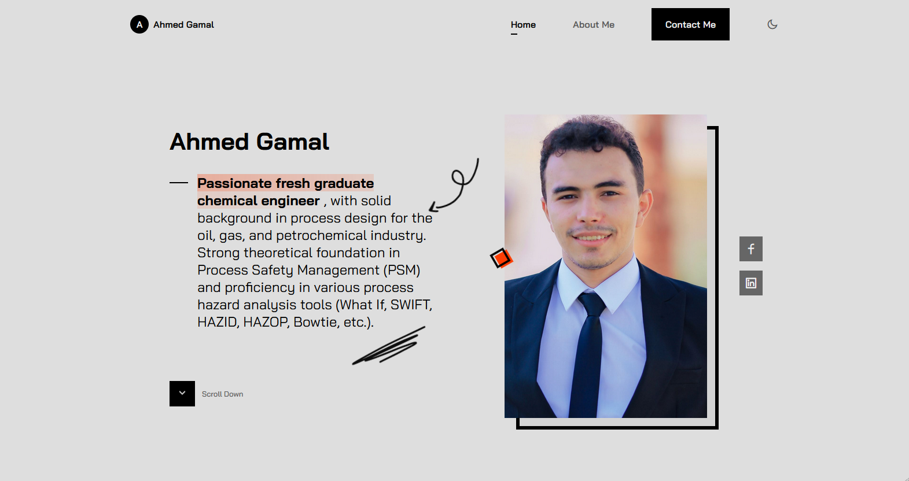
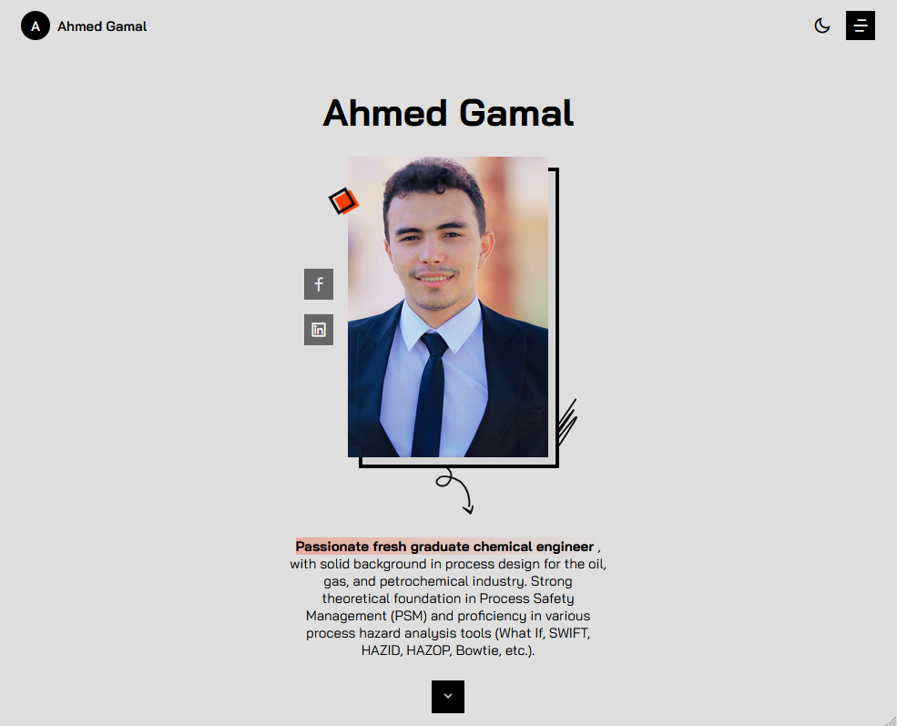
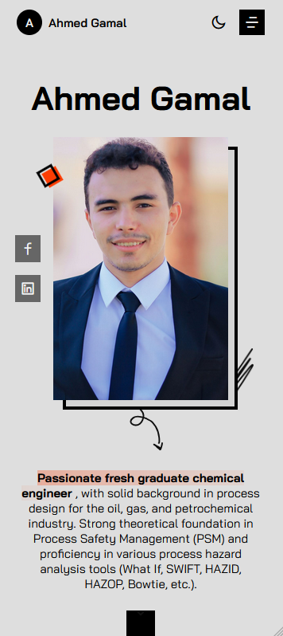

# Chemical Engineer Portfolio Website

This is a professional portfolio website built for a chemical engineer to showcase their skills, projects, and experience. The website played a key role in helping them secure a job at **Enbbi Company**.

## 🚀 Features

- **Modern & Responsive Design**: Fully optimized for all devices.
- **Professional Portfolio**: Showcases projects, skills, and experience effectively.
- **Fast & Optimized**: Built with performance in mind.
- **SEO Friendly**: Optimized for search engines to improve visibility.
- **Contact Form**: Easy communication with potential employers or clients.

## 🛠️ Tech Stack

- **HTML** – Structure and content
- **CSS** – Styling and layout
- **JavaScript** – Interactive elements and functionality

## 📸 Screenshots

- 
- 
- 

## 📂 Project Setup

1. Clone the repository:
   ```bash
   git clone https://github.com/yourusername/chemical-engineer-portfolio.git
   ```
2. Navigate to the project directory:
   ```bash
   cd chemical-engineer-portfolio
   ```
3. Open the `index.html` file in your browser.

## 🏆 Outcome

This portfolio successfully helped the chemical engineer showcase their expertise and secure a job at **Enbbi Company**.

## 📬 Contact

For any inquiries or collaborations, feel free to reach out at [ahmedmlotfi@outlook.com/contact info].

---

Made with ❤️ by Ahmed Lotfi
